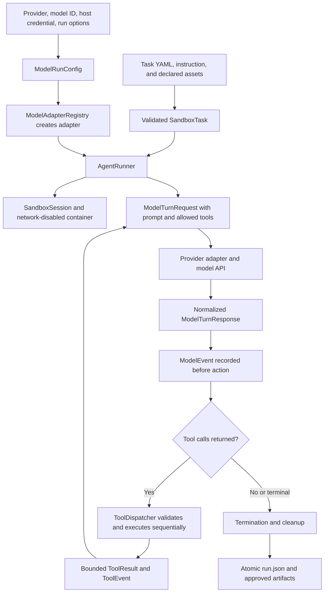

# One Oxygen Sandbox

One Oxygen is a local, provider-neutral agent runner built in phases:

- Phase 1 provides a hardened, persistent Docker sandbox.
- Phase 2 provides deterministic tools, policy enforcement, and bounded tool traces.
- Phase 3A adds a provider-independent model contract, a deterministic agent loop, a
  network-free scripted adapter, and an optional OpenAI Responses API adapter.
- Phase 3B adds explicit inference transports and provenance, official OpenAI Batch execution,
  durable turn-level suspension, immutable workspace checkpoints, a deterministic mock batch
  backend, and an experimental Api.Airforce direct gateway.
- Browser integration adds opt-in, provider-neutral, host-side web research against exact
  reviewed public-source profiles while preserving disabled networking in the execution
  container.

Phase 3B implements official batch execution only for OpenAI. Anthropic, Gemini, xAI, and
DeepSeek batch backends remain intentionally deferred. It does not use an agent framework, the
Assistants API, the OpenAI Agents SDK, hosted provider tools, RAG, graders, a web UI, production
cloud infrastructure, or distributed workers.

## Architecture

`AgentRunner` owns orchestration. A provider may request function calls, but it cannot execute
them. Every request is normalized to a `ToolCall`, checked by `ToolDispatcher`, and executed
against the same active `SandboxSession`.

The main boundaries are:

- `SandboxSession`: creates the temporary workspace and hardened container, preserves state
  across tool calls, stops the container, collects artifacts, persists `run.json`, and removes
  temporary resources.
- `SecureWorkspace`: exposes a workspace-only filesystem view to file tools and rejects
  traversal, symbolic links, protected paths, binary text operations, and oversized data.
- `SecureBrowserClient`: provides host-side, read-only retrieval from exact selected public
  HTTPS hosts while the execution container remains network-disabled.
- `ToolRegistry` and `ToolDispatcher`: expose canonical provider-neutral schemas, enforce
  `ToolPolicy`, execute calls sequentially, normalize errors, track submission, and write
  bounded `ToolEvent` records.
- `ModelAdapter`: translates one provider's private conversation representation to and from
  `ModelTurnRequest`, `ModelTurnResponse`, and the canonical tool protocol.
- `ModelAdapterRegistry`: registers adapter factories deterministically and checks optional
  dependencies without importing SDKs or contacting providers during listing.
- `AgentRunner`: enforces turns, provider requests, tokens, wall time, retries, finish states,
  artifact-selection rules, and cleanup across every runtime exit path.
- `DurableAgentCoordinator`: persists ready turns and validated state transitions in SQLite,
  submits compatible turns through a `BatchBackend`, and resumes each run independently.
- `WorkspaceCheckpoint`: finalizes bounded immutable generations with a SHA-256 manifest and
  restores a logical workspace into a new hardened container for the next tool round.

The model API client and its credentials remain in the host process. Only model-requested shell
and Python work is executed in Docker; the SDK is never installed in or passed to the sandbox.

## Task Configuration and Model-Run Configuration

Task content and model execution settings are separate experimental dimensions.

The task YAML contains sandbox policy, input assets, tool policy, an optional
provider-independent `agent` section, and an optional exact-source `browser` section. It does not
contain a provider, model ID, API key, temperature, or retry settings. Existing Phase 1 and Phase
2 task files without `agent` or `browser` continue to load and work.

The Phase 3A example uses:

```yaml
agent:
  instruction_file: task.md
  system_prompt_version: standard_agent_v1
  maximum_model_turns: 6
  maximum_provider_requests: 8
  maximum_total_input_tokens: 20000
  maximum_total_output_tokens: 5000
  maximum_total_tokens: 25000
  overall_wall_time_seconds: 90
  required_submission: true
  final_text_without_submission: incomplete
```

`instruction_file` and an optional `system_prompt_file` must be safe task-relative UTF-8
files. With no custom prompt file, `standard_agent_v1` resolves to the packaged,
provider-neutral prompt in `src/oneoxygen_sandbox/prompts/standard_agent_v1.txt`.

`ModelRunConfig` is supplied independently by the caller; `agent-run` builds one from its
standard CLI options. The model contains:

- provider and required model ID;
- maximum output tokens per provider response;
- optional temperature;
- per-attempt model-call timeout;
- maximum central retry attempts and initial retry delay;
- bounded provider settings for programmatic callers (the standardized Phase 3A adapters reject
  non-empty provider settings);
- tool-schema mode; and
- the provider-response storage request.

All values are validated in immutable Pydantic models. Adapters reject unsupported settings with
`unsupported_parameter`; they do not silently drop them. Requested configuration and effective
adapter settings are recorded separately in `run.json`. No model name is hard-coded as a
default.

## Adding or Selecting a Model

Model IDs are runtime inputs, not entries in the repository. To run a model through an already
supported provider, install its optional SDK if needed, keep the API key in the host environment,
and pass the exact provider/model pair:

```powershell
python -m oneoxygen_sandbox models list
python -m oneoxygen_sandbox models doctor --provider openai
python -m oneoxygen_sandbox agent-run path/to/task.yaml `
  --provider openai `
  --model "<PROVIDER_MODEL_ID>"
```

The task YAML remains provider-independent, so the same task, browser source profiles, prompt,
tool policy, and scoring conditions can be reused with another adapter. `ModelRunConfig` records
the provider, requested model ID, inference transport, output limit, timeout, retry policy,
sampling settings, schema mode, and provider-storage request. No provider key or default model ID
is stored in the task.

Adding a new provider such as a direct Anthropic/Claude adapter requires these code-level
extension points:

1. Add its stable value to `ModelProvider` and define its allowed transport/provenance rules in
   `ModelRunConfig`.
2. Implement `ModelAdapter` in `src/oneoxygen_sandbox/model_adapters/<provider>.py`. The adapter
   validates configuration, declares factual capabilities, owns private conversation state,
   converts canonical `ToolDefinition` values to the provider's function/tool format, and
   normalizes provider output into `ModelTurnResponse`.
3. Keep authentication and SDK objects inside the host adapter. Never place credentials in task
   YAML, prompts, tool calls, Docker environment variables, or run records.
4. Add a lazy factory to `model_adapters/registry.py` and register it in
   `default_model_adapter_registry()`, with an optional dependency name when an SDK is required.
   Listing providers must continue to work without importing the SDK or making a network call.
5. Export the adapter where appropriate, add its optional package dependency and CLI credential
   checks, and add mocked contract tests for schemas, tool calls, usage, finish reasons, retries,
   timeouts, malformed output, sanitization, and secret separation.
6. Implement a separate `BatchBackend` only if the provider has a supported asynchronous batch
   API. A direct adapter does not automatically create batch support.

An adapter must expose only One Oxygen's canonical custom tools. Provider-hosted web search,
computer use, code execution, file search, MCP, or similar hosted tools are not silently enabled.
The browser integration therefore works unchanged for any new adapter: the provider sees
`browser_sources` and `browser_open` as ordinary canonical function definitions when the task
allows them, and their calls return through the same dispatcher as every other model.

## End-to-End Evaluation Lifecycle

The direct evaluation path is:



For each run, One Oxygen performs the following:

1. `load_task()` parses the task YAML into immutable models and validates sandbox paths, agent
   limits, tool permissions, data classification, and optional browser configuration.
2. The CLI builds `ModelRunConfig` from `--provider`, `--model`, transport, timeout, retry, output,
   temperature, schema, and provider-storage options.
3. `ModelAdapterRegistry` resolves a registered provider, verifies its optional SDK, and creates
   the adapter. The adapter validates the requested settings before any provider call.
4. `AgentRunner` safely reads the instruction and system prompt. For browser-enabled tasks it
   appends the selected source profiles, exact hosts, and untrusted-web-content rule.
5. The runner filters the canonical registry to only the definitions allowed by `ToolPolicy`,
   hashes that exact schema set, and verifies that a required submission tool is present.
6. `SandboxSession` creates the initial version 4 `RunRecord`, a private temporary workspace, and
   one hardened network-disabled container. Declared input assets are copied into the workspace;
   provider credentials are not.
7. The runner initializes host-side adapter conversation state and sends a `ModelTurnRequest`
   containing the turn number, prompt, instruction, allowed tool definitions, normalized run
   configuration, and any results from the preceding turn.
8. The adapter translates that request to its provider API. One Oxygen applies the remaining wall
   time to the request timeout and centrally retries only classified transient failures.
9. Provider output is normalized and identity-checked for provider, model, transport, host, and
   provenance. Inconsistent routes are rejected before the response can be accepted.
10. Before executing any requested tool, the normalized response is appended as a `ModelEvent`
    containing bounded text, its complete SHA-256, ordered tool-call traces, finish reason, usage,
    attempts, latency, warnings, sanitized provider metadata, and requested/returned model IDs.
11. Duplicate call IDs are rejected. Otherwise, if the response contains tool calls,
    `ToolDispatcher` validates their arguments and processes them sequentially in provider order.
    Every returned call consumes the configured call budget, including unknown, invalid,
    disallowed, or over-limit calls. Required-submission reachability is rechecked as budgets are
    consumed.
12. Each call becomes a bounded `ToolResult` for the next model turn and a hashed `ToolEvent` for
    the run record. Model-visible failures use normalized error codes without internal paths,
    secrets, SDK objects, or stack traces.
13. The loop continues with the same workspace until successful submission, final text, refusal,
    content filtering, a provider failure, model/tool/token/turn/time limit, sandbox failure,
    cancellation, or an internal orchestration error.
14. A successful `submit_result` closes submission state. Later calls in the same provider
    response are still recorded but fail with `already_submitted`.
15. The container is stopped before artifact collection. Only explicitly submitted files under
    the permitted output directory are copied, size-checked, and SHA-256 verified.
16. Terminal status, reason, metrics, errors, timestamps, and artifact metadata are finalized.
    `run.json` is written atomically, the adapter is closed, the container is removed, and the
    temporary workspace is deleted on every terminal path.

Provider-batch evaluations use `eval enqueue` and `DurableAgentCoordinator` instead of keeping a
direct call open. The coordinator persists ready-turn state in SQLite, materializes compatible
batch requests, restores immutable workspace checkpoints before tool execution, applies results
by internal request ID, and eventually produces the same normalized model/tool events and final
run record. Only OpenAI currently has an official provider-batch backend.

### Tools a model can call

The model receives only definitions allowed by the task. Registration alone does not grant
permission.

| Tool | Availability and execution boundary |
|---|---|
| `list_files` | Default. Lists bounded workspace entries through `SecureWorkspace`; symbolic links and protected paths are excluded. |
| `read_text_file` | Default. Reads bounded UTF-8 workspace text with optional line ranges. |
| `write_text_file` | Default. Atomically writes bounded UTF-8 workspace files subject to path and overwrite rules. |
| `replace_text` | Default. Atomically performs an exact replacement only when the expected match count is satisfied. |
| `submit_result` | Default. Submits the final summary, optional structured findings, and explicit output artifact paths. |
| `execute_shell` | Optional. Runs inside the hardened container only when the tool name is allowed and `shell_execution_allowed` is true. Container networking remains disabled. |
| `execute_python` | Optional. Runs a temporary source file inside the hardened container only when allowed and `python_execution_allowed` is true. |
| `browser_sources` | Optional browser tool. Returns selected profiles, exact hosts, and policy hash without a network request. |
| `browser_open` | Optional browser tool. Performs a host-side, read-only request to one exact selected HTTPS host; it is unavailable without validated browser configuration. |

The model cannot call Docker, raw sockets, a generic HTTP client, provider SDKs, arbitrary host
filesystem APIs, browser DevTools, or any tool not present in its request. Shell or Python cannot
bypass the browser policy because those tools execute in the network-disabled container.

### How responses and artifacts are stored

Local normalized storage and provider-side storage are separate:

| Data | Storage behavior |
|---|---|
| Model response | Stored locally as a bounded, sanitized `ModelEvent` in `runs/<run-id>/run.json`. It includes response text up to the event limit, a SHA-256 of the complete original text, tool-call traces, usage, timing, finish reason, requested/returned model, attempts, warnings, and allowlisted metadata. |
| Tool call and result | Stored as a bounded `ToolEvent` with sequence, call ID, tool name, redacted/bounded arguments, status, normalized error code, timing, result preview, and complete argument/result hashes. The bounded `ToolResult` is also returned to the model on the next turn. |
| Browser response | Stored through the same `ToolEvent` path as bounded extracted text and metadata. Raw unrestricted response bodies, headers, cookies, and browser caches are not retained. URL query values in traces are replaced by size and SHA-256. |
| Prompt and task | The bounded system prompt and complete prompt hash are stored. The task instruction is represented by its SHA-256; host task paths are not persisted. |
| Configuration and provenance | Stores task/configuration hashes, requested and effective model settings, adapter route, API host, inference transport, provenance, browser configuration, exact allowed hosts, and browser policy hash. |
| Submission | Stores the submitted summary, optional structured findings, requested artifact paths, and verified artifact metadata. |
| Files | Only successfully submitted files are retained under `runs/<run-id>/artifacts/`. Other temporary workspace files are deleted during cleanup. |
| Metrics and terminal outcome | Stores aggregate model turns, provider attempts, tool counts, token fields when reported, latency, total wall time, final status, termination reason, sanitized error, and timestamps. |
| Provider-side response | Disabled by default. `--store-provider-response` requests provider storage only when the adapter supports it; for OpenAI the normal default is `store=False`. This option does not change the bounded local run record. |
| Secrets and raw provider objects | Never stored. API keys, authorization headers, unrestricted SDK responses, stack traces, Docker secrets, and host workspace paths are excluded or sanitized. |

The direct runner accumulates normalized events in the in-memory `RunRecord` and atomically writes
the complete JSON record during terminal session cleanup. Durable/batch runs additionally persist
coordinator state, batch correlation data, and immutable workspace checkpoint generations so a
run can resume without treating provider-private response objects as benchmark evidence.

Legacy `run` and `tool-demo` workflows retain their Phase 1/2 behavior and collect approved files
from the configured output directory.

## Model Adapter Contract

An adapter exposes:

- a stable `provider` identifier;
- factual `ModelCapabilities`;
- `validate_config()`;
- `start_conversation()`;
- `generate_next_turn()`; and
- `close()`.

The common request carries only the turn number, system prompt, initial instruction, canonical
tool definitions, previous tool results, and normalized run configuration. It never carries API
keys or host paths.

The normalized response carries requested and returned model IDs, bounded text, ordered tool
calls, a stable finish reason, normalized token usage, latency, retry attempts, warnings, and
allowlisted provider metadata. Provider-specific conversation state remains private to the
adapter so opaque response items can be round-tripped without flattening them into a generic
chat-message history.

The default registry includes:

- `scripted`, available in the base installation;
- `openai`, available when the optional `openai` dependency is installed; and
- `airforce`, the explicitly acknowledged experimental Api.Airforce gateway, which also uses the
  optional OpenAI-compatible SDK.

Listing adapters is deterministic, makes no network request, and does not import the optional
provider SDK.

## Scripted Adapter

`ScriptedModelAdapter` is the deterministic primary test adapter. It needs no API key, SDK, or
network access. A versioned YAML or JSON script can define text, multiple tool calls, normalized
finish reasons, synthetic usage, previous-result expectations, simulated transient or permanent
provider errors, and simulated timeouts.

Run the complete synthetic due-diligence example through the real runner, dispatcher, persistent
Docker sandbox, submission flow, and artifact collector:

```powershell
python -m oneoxygen_sandbox agent-run examples/agent_demo/task.yaml `
  --provider scripted `
  --model scripted-demo `
  --script examples/agent_demo/model_script.yaml
```

If `--script` is omitted for the scripted provider, the CLI uses `model_script.yaml` beside
the task YAML. The example inspects synthetic company metrics, calculates revenue growth and
gross margin, creates `/workspace/output/findings.md`, and submits it.

## OpenAI Responses API Adapter

OpenAI support is optional:

```powershell
python -m pip install -e ".[dev,openai]"
```

The adapter uses the official Python SDK's Responses API, following the current
[Responses migration guide](https://developers.openai.com/api/docs/guides/migrate-to-responses)
and [function-calling guide](https://developers.openai.com/api/docs/guides/function-calling).
It does not use the Assistants API or the OpenAI Agents SDK.

For every request, the adapter:

- calls `client.responses.create` with the caller's model ID;
- sends only One Oxygen's custom function definitions;
- never enables web search, file search, code interpreter, computer use, MCP, or another hosted
  tool;
- sets `store=False` and does not use `previous_response_id`;
- requests encrypted reasoning content and locally replays all required output items when
  continuing a stateless conversation;
- correlates `function_call` and `function_call_output` items by provider `call_id`;
- parses function arguments as strict JSON and never repairs malformed arguments heuristically;
- serializes bounded tool results as `success`, `content`, and sanitized `error`;
- maps available input, output, reasoning, cached-input, and total-token fields without inventing
  missing values; and
- records both requested and returned model identifiers.

`parallel_tool_calls=True` allows the model to return multiple calls in a response. One Oxygen
still executes those calls deterministically and sequentially.

The OpenAI SDK's automatic retries are disabled with `max_retries=0`. One Oxygen supplies the
configured request timeout and owns all retry decisions and attempt tracing.

### API Key Setup in PowerShell

Set the key only in the host process:

```powershell
$env:OPENAI_API_KEY = "<YOUR_OPENAI_API_KEY>"
python -m oneoxygen_sandbox models doctor --provider openai
python -m oneoxygen_sandbox agent-run examples/agent_demo/task.yaml `
  --provider openai `
  --model "<MODEL_ID>"
```

The repository includes `.env.example`, but One Oxygen does not automatically load `.env`
files. Actual `.env` files are ignored by Git. Never put a key in task YAML, CLI arguments,
model settings, scripts, tool arguments, or run records.

## Portable and Native Tool Schemas

`portable` is the default standardized mode. It translates the Phase 2 `ToolDefinition`
envelope without changing tool names, descriptions, logical fields, required fields, allowed
values, or meanings. For OpenAI, portable mode explicitly uses non-strict function schemas so
future cross-provider comparisons do not receive an OpenAI-only schema advantage.

`native_strict` is reserved as a future provider-native mode, but no Phase 3A adapter claims to
implement it. Both OpenAI and scripted runs reject it with `unsupported_parameter`. A future
implementation must transform and validate the canonical schemas without changing their logical
meaning, record the mode explicitly, and keep its results separate from the portable track.

## Limits, Stop Conditions, and Retries

The task controls maximum model turns, provider requests, cumulative input tokens, cumulative
output tokens, cumulative total tokens, and overall agent wall time. The model-run configuration
controls maximum output tokens per response, model-call timeout, and central retry behavior.
Sandbox, command, tool-call, file-size, CPU, memory, and PID limits remain independently enforced.

Token limits are checked after each recorded response. If usage is absent, fields remain null and
the record warns that exact enforcement was unavailable; One Oxygen does not silently estimate
tokens.

Agent terminal statuses include:

- `succeeded`: a valid submission completed, or explicitly permitted final text completed;
- `incomplete`: final text arrived without a required submission;
- `refused`: the model refused or content filtering stopped the response;
- `limit_exceeded`: a turn, provider-request, token, output-length, or wall-time limit stopped
  the run;
- `provider_error`: provider failures exhausted the allowed policy;
- `sandbox_error`: sandbox startup, execution, artifact verification, or cleanup failed;
- `cancelled`: user interruption or provider cancellation; and
- `internal_error`: unexpected orchestration failure.

One Oxygen centrally retries only errors classified as transient: rate limits, request timeouts,
connection failures, provider unavailability, and retryable server failures. It uses bounded
exponential backoff with injectable jitter and sleep functions. Authentication, permission,
invalid-request, unsupported-parameter, malformed-response, malformed-argument, and
context-limit failures are not retried. Every attempt records its category, retryability, delay,
timestamps, and latency.

## Tool Protocol and Policy

Available provider-neutral tools are:

- `list_files`: list bounded workspace entries without following symbolic links.
- `read_text_file`: read bounded UTF-8 text with optional line ranges.
- `write_text_file`: atomically write UTF-8 text.
- `replace_text`: atomically replace exact text only when the expected count matches.
- `execute_shell`: execute a shell command inside the active sandbox container.
- `execute_python`: execute a temporary Python source file inside the active container.
- `browser_sources`: inspect the task-selected public source profiles and exact HTTPS hosts
  without making a network request.
- `browser_open`: retrieve one allowlisted HTTPS text page through the host-side browser broker.
- `submit_result`: submit final findings and approved output artifacts.

`execute_shell` and `execute_python` are disabled unless explicitly enabled by the task's
`ToolPolicy`. Browser tools require an explicit public/synthetic browser configuration and remain
disabled by the default policy. The default policy permits bounded file operations and submission.

Example:

```yaml
tool_policy:
  allowed_tool_names:
    - list_files
    - read_text_file
    - execute_python
    - write_text_file
    - submit_result
  max_total_tool_calls: 10
  per_tool_call_limits:
    execute_python: 1
    submit_result: 1
  max_read_size_bytes: 65536
  max_write_size_bytes: 65536
  max_file_list_entries: 100
  python_timeout_seconds: 10
  max_tool_result_size_bytes: 32768
  shell_execution_allowed: false
  python_execution_allowed: true
  protected_workspace_paths:
    - .oneoxygen
    - .oneoxygen/tool-runtime
```

Tool schemas are sorted deterministically. Tool arguments and results are bounded and hashed in
the trace; sensitive large content such as written file bodies and Python source is replaced by
its size and SHA-256 digest.

## Browser Integration

The browser integration is implemented as host-side canonical tools rather than a provider-hosted
search feature. A model requests `browser_sources` or `browser_open`; `ToolDispatcher` applies the
task policy; and `SecureBrowserClient` performs a bounded read outside the network-disabled
execution container. This keeps browser behavior consistent across model providers and prevents
model API credentials from entering either the browser request or the container.

The current OpenAI Responses, Api.Airforce, and scripted adapters receive the same browser tool
definitions through `ModelTurnRequest`. The repository does not yet contain a direct
Anthropic/Claude adapter. A future Claude or other provider adapter implementing the existing
`ModelAdapter` contract receives the same canonical tools without browser-specific provider code.

The implemented backend is a text browser for HTML, JSON, XML, XBRL, and plain text. It does not
render JavaScript, launch a GUI browser, take screenshots, retain cookies, fill forms, upload
files, download binary documents, or expose a general HTTP client.

### Enabling browser access

Browser access is off by default. A task must select immutable source profiles, explicitly allow
`browser_open`, classify agent data as `public` or `synthetic`, and supply a truthful
publisher-facing user agent:

```yaml
tool_policy:
  allowed_tool_names:
    - list_files
    - read_text_file
    - write_text_file
    - browser_sources
    - browser_open
    - submit_result
  max_total_tool_calls: 30
  per_tool_call_limits:
    browser_open: 12

browser:
  mode: live_web
  source_profiles:
    - sec_edgar
    - us_macro
  request_timeout_seconds: 20
  maximum_redirects: 5
  maximum_response_size_bytes: 5242880
  maximum_text_characters: 60000
  maximum_links: 100
  requests_per_second: 2
  user_agent: "BenchmarkName/1.0 diligence-contact@example.com"

agent:
  instruction_file: task.md
  data_classification: public
```

`browser_sources` is optional but useful for allowing the model to inspect the selected profiles.
`browser_open` is mandatory whenever a `browser` block exists. Browser tools without browser
configuration fail task validation. Browser configuration on an agent task with missing,
`internal`, `confidential`, or `restricted` classification also fails validation. Existing tasks
without a browser block retain their previous configuration hash and behavior.

The defaults shown above apply unless a task chooses stricter values. `source_profiles` must
contain at least one built-in `BrowserSourceProfile`; duplicate profiles are removed. The model
cannot add hosts, supply headers or credentials, change the HTTP method, or expand the policy
through tool arguments.

### Built-in U.S. financial-due-diligence sources

Profiles contain exact hosts, not suffix wildcards. Selecting `sec_edgar` does not allow every
SEC or `.gov` subdomain.

| Profile | Exact allowed hosts | Typical diligence use |
|---|---|---|
| `sec_edgar` | `sec.gov`, `www.sec.gov`, `data.sec.gov`, `efts.sec.gov` | SEC filings, exhibits, submissions, filing search, and XBRL company facts. |
| `us_macro` | `fred.stlouisfed.org`, `api.stlouisfed.org`, `www.bls.gov`, `download.bls.gov`, `www.bea.gov`, `apps.bea.gov`, `www.census.gov`, `api.census.gov`, `data.census.gov`, `fiscaldata.treasury.gov`, `api.fiscaldata.treasury.gov` | Macroeconomic, labor, industry, demographic, and fiscal data. |
| `regulated_financial` | `banks.data.fdic.gov`, `www.ffiec.gov`, `www.occ.gov`, `www.consumerfinance.gov`, `files.consumerfinance.gov` | Bank identity, structure, financial trends, enforcement, and complaint data. |
| `federal_counterparty` | `sam.gov`, `api.sam.gov`, `open.gsa.gov`, `usaspending.gov`, `www.usaspending.gov`, `api.usaspending.gov` | Federal entity registration, exclusions, contracts, grants, and awards. |
| `ofac_sanctions` | `ofac.treasury.gov`, `sanctionssearch.ofac.treas.gov`, `sanctionslist.ofac.treas.gov` | OFAC sanctions-list screening and follow-up review. |
| `antitrust` | `www.ftc.gov`, `www.justice.gov` | FTC and DOJ antitrust cases, proceedings, and merger materials. |
| `workplace_environment` | `echo.epa.gov`, `www.osha.gov` | EPA facility enforcement and OSHA establishment-inspection data. |
| `us_ip` | `www.uspto.gov`, `ppubs.uspto.gov`, `data.uspto.gov`, `tsdr.uspto.gov`, `tmsearch.uspto.gov` | Patent and trademark search, status, and public documents. |
| `tax_exempt` | `www.irs.gov`, `apps.irs.gov` | Exempt-organization status and public Form 990 material. |
| `healthcare_public` | `www.fda.gov`, `open.fda.gov`, `api.fda.gov`, `www.cms.gov`, `data.cms.gov` | FDA approvals, recalls, safety data, providers, and reimbursement. |
| `energy_public` | `www.eia.gov`, `api.eia.gov`, `www.ferc.gov`, `elibrary.ferc.gov` | Energy data, tariffs, orders, and filings. |
| `telecom_public` | `www.fcc.gov`, `publicfiles.fcc.gov` | FCC licenses, proceedings, ownership reports, and public files. |

Licensed platforms, fee-bearing court systems, state registries with anti-automation terms,
general search engines, news sites, social networks, issuer sites, and user-supplied origins are
not enabled by these profiles. Some public APIs require publisher keys; key-required routes remain
unavailable because the current browser broker does not inject credentials. The source research,
licensed-platform review, and rules for adding future profiles are documented in
[browser-integration.md](browser-integration.md).

### Browser request and response policy

Every `browser_open` call enforces the following:

- only absolute `https://` URLs using port 443 and an exact selected hostname are accepted;
- user information, passwords, IP literals, wildcard hosts, unlisted subdomains, backslashes,
  whitespace, control characters, and non-default ports are rejected; fragments are removed;
- DNS is resolved by the broker, every answer must be globally routable, and mixed
  public/private results fail closed;
- the validated IP address is pinned for the connection while the original hostname remains in
  TLS SNI and certificate verification;
- every redirect is checked against the same policy before it is followed;
- requests use only `GET`, a fixed safe header set, no cookies, no session state, no body, and the
  task's declared user agent;
- time, redirect, response-byte, extracted-text, link, total-tool-call, per-tool-call, and
  per-host rate limits are enforced;
- only supported text content is returned, scripts and style content are omitted from HTML
  extraction, and returned links must pass the same exact-host policy; and
- page content is marked as untrusted evidence so web instructions cannot change the task,
  system prompt, tool policy, or source catalog.

A successful result contains the requested and final URL, redirect chain, HTTP status, content
type, title, bounded text, same-policy links, matching source profile, UTC retrieval timestamp,
captured byte count and SHA-256, truncation flags, and an explicit untrusted-content warning.
Unsupported content, network failure, blocked URLs, missing browser configuration, and redirect
exhaustion return normalized browser tool error codes.

Browser query values are removed from persisted tool-call arguments and replaced with their byte
count and SHA-256. `RunRecord` schema version 4 additionally stores the validated
`browser_configuration`, sorted `browser_allowed_hosts`, and `browser_policy_sha256`. The policy
digest covers the browser configuration, policy version, selected profiles, and exact hosts.

### Chrome, Firefox, Brave, and other desktop-browser policies

The policy compiler derives deterministic baselines for `chrome`, `chromium`, `edge`, `brave`,
`firefox`, `safari`, `opera`, and `vivaldi` from the same exact-host source catalog.

| Browser family | Generated controls |
|---|---|
| Chrome, Chromium, Edge, Opera, Vivaldi | Deny-all URL blocklist, exact-host allowlist, fixed loopback proxy, empty bypass list, QUIC and browser DNS-over-HTTPS disabled, DevTools disabled, sign-in/sync/password/autofill/search restrictions, and an extension-install blocklist. |
| Brave | Chromium controls plus Tor, Rewards, Wallet, VPN, and AI chat disablement. |
| Firefox | Deny-all `WebsiteFilter` with exact-host exceptions, locked manual proxy and proxy DNS, DNS-over-HTTPS disabled, and account/private-browsing/password/autofill restrictions. |
| Safari | An explicit MDM input manifest requiring a Safari WebExtension declarative ruleset and device network filter. It is not emitted as an installable profile. |

Inspect the source catalog and compile a policy without making a network request:

```powershell
python -m oneoxygen_sandbox browser sources
python -m oneoxygen_sandbox browser policy `
  --family brave `
  --profiles sec_edgar,ofac_sanctions `
  --proxy-server http://127.0.0.1:8765 `
  --user-agent "BenchmarkName/1.0 diligence-contact@example.com"
```

The policy command accepts only a loopback HTTP proxy with an explicit port and emits JSON with
the allowed hosts, source-policy hash, browser-family policy, and complete bundle hash. It does
not install policy, package an extension, launch a browser, or verify effective policy. A
JavaScript-capable managed-browser backend still requires an authoritative egress proxy and
network namespace, ephemeral profiles, extension/enterprise-policy deployment, download
quarantine, complete network tracing, and browser-specific conformance tests.

### Browser integration file map

| File | Browser-integration responsibility |
|---|---|
| `browser-integration.md` | Full source research, threat model, architecture, public and licensed source rules, cross-browser deployment specification, evidence policy, and implementation status. |
| `src/oneoxygen_sandbox/browser.py` | Immutable source catalog, exact URL validation, policy hashing and prompt appendix, DNS checks, pinned TLS client, redirect enforcement, rate limiting, text decoding, HTML extraction, and same-policy link filtering. |
| `src/oneoxygen_sandbox/browser_policies.py` | Deterministic Chrome-family, Brave, Firefox, and Safari policy-bundle compilation with loopback-proxy validation and bundle hashing. |
| `src/oneoxygen_sandbox/tools/browser.py` | Canonical `browser_sources` and `browser_open` schemas, dispatcher-facing execution, normalized browser failures, and structured result-size fitting. |
| `src/oneoxygen_sandbox/models.py` | `BrowserMode`, `BrowserSourceProfile`, `BrowserConfig`, browser error codes, task cross-validation, and version 4 browser run-record fields. |
| `src/oneoxygen_sandbox/config.py` | Includes configured browser policy in canonical task hashes while preserving hashes for legacy tasks without browser configuration. |
| `src/oneoxygen_sandbox/session.py` | Records browser configuration, exact allowed hosts, and the browser policy digest when a run starts. |
| `src/oneoxygen_sandbox/agent.py` | Adds selected profiles, exact hosts, and untrusted-content guidance to direct-agent system prompts. |
| `src/oneoxygen_sandbox/coordinator.py` | Adds the same deterministic browser prompt appendix to durable/batch-coordinated agent turns. |
| `src/oneoxygen_sandbox/cli.py` | Adds `browser sources` and `browser policy` commands. |
| `src/oneoxygen_sandbox/tools/base.py` | Redacts browser query strings from persisted tool arguments and records only their size and hash. |
| `src/oneoxygen_sandbox/tools/registry.py` | Registers both browser tools and permits an injected browser client for deterministic tests or alternate backends. |
| `src/oneoxygen_sandbox/tools/__init__.py` | Exports the browser client protocol, secure client, and browser tools through the tools package. |
| `src/oneoxygen_sandbox/__init__.py` | Exports browser configuration types and the managed-policy compiler through the public package API. |
| `tests/test_browser.py` | Tests exact-host URL policy, URL normalization, private/mixed DNS rejection, redirect enforcement, HTML extraction, untrusted labeling, source hashes, and public-only task validation. |
| `tests/test_browser_policies.py` | Tests deterministic Chrome/Brave/Firefox/Safari output, exact filters, family lockdowns, loopback-proxy rejection, and browser CLI commands. |
| `tests/test_tools.py` | Tests browser schema registration, selected-source output, model-call dispatch, off-list rejection before client access, query redaction, run-record fields, and structured result truncation. |
| `tests/test_agent_runner.py` | Tests that allowed browser tools and exact hosts reach model adapters through the canonical prompt/tool contract without exposing secrets to Docker. |
| `tests/test_model_contracts.py` | Verifies legacy task hashes remain stable when the optional browser field is absent. |
| `README.md` | Provides the operator-facing overview, configuration, source catalog, security behavior, policy commands, limitations, and this file map. |

## Security and Fairness Guarantees

Each run uses:

- one fresh private temporary workspace;
- a non-root numeric container user;
- disabled container networking;
- a read-only root filesystem;
- one writable `/workspace` bind mount;
- a hardened in-memory `/tmp`;
- all Linux capabilities dropped and `no-new-privileges`;
- CPU, memory, PID, command, tool, and time limits;
- no Docker socket or repository mount; and
- cleanup on success, failure, refusal, limit, interruption, and timeout.

Additional Phase 3A guarantees are:

- provider SDKs and credentials stay in the host orchestrator;
- provider secret names, including `OPENAI_API_KEY`, cannot be allowlisted into Docker;
- only canonical custom functions are offered to models;
- every model-requested tool call passes through the same dispatcher and sandbox policy;
- multiple calls mutate the shared workspace sequentially in provider order;
- tool and model errors are sanitized before model-facing output, CLI output, or persistence;
- provider metadata is bounded; the OpenAI adapter records only allowlisted, sanitized fields;
- response bodies, SDK objects, HTTP headers, authorization values, host paths, and unrestricted
  stack traces are not persisted;
- only successfully submitted agent artifacts are retained; and
- no monetary cost is calculated because pricing is intentionally outside Phase 3A.

## Tracing and Reproducibility

Retained runs are written as:

```text
runs/<run-id>/
|-- run.json
`-- artifacts/
    `-- ...successfully submitted agent artifacts...
```

The version 4 `RunRecord` preserves the Phase 1/2 sandbox policy, command results, tool policy,
tool events, submission, final status, errors, and artifact hashes. Agent runs add:

- requested model configuration and effective settings;
- versioned `ModelEvent` entries with attempt history;
- requested and returned model IDs;
- normalized finish reasons and original provider status metadata;
- bounded model text plus its complete SHA-256 hash;
- ordered normalized tool calls and original indexes;
- usage, latency, warnings, and sanitized provider request IDs;
- system-prompt version, bounded content, and complete hash;
- task-instruction hash and canonical tool-definition hash;
- termination reason; and
- aggregate model, provider-attempt, tool, token, latency, and wall-time metrics.

Browser-enabled runs additionally record the complete validated browser configuration, sorted
exact host set, and browser policy SHA-256. Browser tool events retain bounded results and hashes,
while URL query values in call arguments are replaced with their size and hash.

Missing provider usage remains unavailable rather than being changed to zero. No raw provider
object, API key, unrestricted response, or host workspace is retained.

## CLI

Check and build Docker:

```powershell
python -m oneoxygen_sandbox doctor
python -m oneoxygen_sandbox build
```

Preserved Phase 1 and Phase 2 commands:

```powershell
python -m oneoxygen_sandbox run examples/basic/task.yaml
python -m oneoxygen_sandbox tools list
python -m oneoxygen_sandbox tools list --json
python -m oneoxygen_sandbox tool-demo examples/tool_demo/task.yaml
```

Inspect adapters without a network request:

```powershell
python -m oneoxygen_sandbox models list
python -m oneoxygen_sandbox models list --json
python -m oneoxygen_sandbox models doctor --provider scripted
python -m oneoxygen_sandbox models doctor --provider openai
```

Agent runs use distinct non-zero exit codes for invalid configuration, unavailable providers,
missing API keys, provider errors or refusals, incomplete runs, limit exhaustion, sandbox
failures, cancellation, and internal errors.

## Direct and Batch Inference

`InferenceTransport` separates `direct`, `provider_batch`, and `gateway_direct` execution.
`ProvenanceClassification` separately identifies `official_provider`,
`third_party_gateway_unverified`, and `scripted_test` results. Every model event and run record
also carries the logical provider, API host, requested and returned model, official-route flag,
upstream-verifiability flag, and batch identifiers when applicable. Provider identity is the API
party contacted by One Oxygen: an Airforce response remains provider `airforce` regardless of
the model-shaped identifier returned by the gateway.

Direct OpenAI calls and OpenAI Batch lines use the same Responses API compiler, output parser,
tool-call normalization, usage mapping, finish-reason mapping, prompts, tool definitions, and
generation settings. The transport changes only submission and retrieval. Batch JSONL targets
`/v1/responses`, contains unique opaque `custom_id` values, never streams, and never contains an
API key.

An entire multi-turn agent cannot be submitted as one static batch request because tool results
change its next model input. Phase 3B therefore batches one ready turn per run:

1. Persist runs in `ready_for_model`.
2. Group only matching provider, transport, model, endpoint, tool-schema hash, prompt version,
   schema mode, effective settings, and data-policy class.
3. Build and validate JSONL locally.
4. Submit the batch and persist the remote ID before reporting success.
5. Leave runs suspended in `waiting_for_model` with no live container.
6. Download output and error files, correlate by the durable custom-ID mapping, and reject
   duplicate or unknown IDs.
7. Resume each successful item, execute its tool calls in a fresh sandbox, finalize a checkpoint,
   and enqueue the next turn if needed.
8. Complete only after `submit_result` succeeds.

Successful items are never repeated. Only individually failed retryable items receive a new
attempt ID in a later batch. A timeout or connection loss that leaves remote submission state
unknown records `remote_state_unknown` and disables blind resubmission.

### Workspace checkpoints and crash recovery

Each finalized checkpoint generation contains only permitted regular workspace files plus a
versioned SHA-256 manifest. Capture and finalization are atomic. Symbolic links, traversal,
devices, sockets, named pipes, protected runtime/grader paths, provider credentials, and
oversized checkpoints fail closed. Finalized generations are immutable, older generations follow
a bounded cleanup policy, and host paths are never exposed to the model.

On resume, One Oxygen verifies every file hash, restores into an empty workspace, mounts only
that workspace into a new network-disabled container, executes tools, removes temporary runtime
files, finalizes the next generation, then stops and removes the container. A closed terminal,
process restart, machine restart, or long provider delay does not require a daemon: the SQLite
revision and checkpoint generation are sufficient to continue.

### OpenAI Batch CLI

The commands deliberately separate local construction from external state changes:

```powershell
python -m oneoxygen_sandbox eval enqueue examples/agent_demo/task.yaml `
  --provider openai --model "<MODEL_ID>" --transport provider_batch --count 5
python -m oneoxygen_sandbox batch ready --provider openai
python -m oneoxygen_sandbox batch build --provider openai
python -m oneoxygen_sandbox batch validate "<LOCAL_BATCH_ID>"
python -m oneoxygen_sandbox batch submit "<LOCAL_BATCH_ID>"
python -m oneoxygen_sandbox batch status "<LOCAL_BATCH_ID>"
python -m oneoxygen_sandbox batch collect "<LOCAL_BATCH_ID>"
python -m oneoxygen_sandbox eval resume-ready
python -m oneoxygen_sandbox batch cancel "<LOCAL_BATCH_ID>"
python -m oneoxygen_sandbox batch list --unfinished
```

The official [OpenAI Batch guide](https://developers.openai.com/api/docs/guides/batch)
documents a 50% discount versus synchronous APIs, a separate rate-limit pool, JSONL input via
the Files API, and a 24-hour completion window. Phase 3B records this as documented capability
metadata verified on 2026-07-23; it does not hard-code model prices or claim that every
provider offers the same discount. Token usage and the billing transport are retained, while any
savings estimate remains distinct from a provider invoice.

### Experimental Api.Airforce gateway

Api.Airforce is supported only as `gateway_direct` through its fixed HTTPS base URL
`https://api.airforce/v1` and OpenAI-compatible Chat Completions shape. It has no batch backend.
Its documentation describes upstream routing and failover that One Oxygen does not control, so
every result is `third_party_gateway_unverified`, uses a separate `gateway_unverified`
experiment/leaderboard track, and is never presented as validation of an official provider
identity.

Gateway tasks must explicitly declare `synthetic` or `public`; missing, `internal`,
`confidential`, and `restricted` classifications return `data_policy_violation`. Calls require
`--allow-third-party-gateway`. Only `AIRFORCE_API_KEY` is read, and no official-provider key is
sent. See [docs/provider-risk.md](docs/provider-risk.md) for the full security policy.

The free catalog is discovered live rather than hard-coded:

```powershell
python -m oneoxygen_sandbox models discover --provider airforce --free --tools `
  --operational --allow-third-party-gateway
```

`--free` requires both reported input and output prices to be exactly zero; a badge or model-name
suffix alone is not treated as proof. Live agentic testing also requires the caller-selected
`ONEOXYGEN_AIRFORCE_TEST_MODEL` and skips if zero-cost tool support cannot be verified.

## Setup

PowerShell:

```powershell
py -3.12 -m venv .venv
.\.venv\Scripts\Activate.ps1
python -m pip install --upgrade pip
python -m pip install -e ".[dev]"
python -m oneoxygen_sandbox doctor
python -m oneoxygen_sandbox build
```

Install OpenAI support only when needed:

```powershell
python -m pip install -e ".[dev,openai]"
```

Host keys and explicit live-test gates in PowerShell:

```powershell
$env:OPENAI_API_KEY = "<OPENAI_KEY>"
$env:AIRFORCE_API_KEY = "<AIRFORCE_KEY>"
$env:ONEOXYGEN_RUN_OPENAI_BATCH_LIVE_TESTS = "1"
$env:ONEOXYGEN_OPENAI_BATCH_TEST_MODEL = "<MODEL_ID>"
$env:ONEOXYGEN_RUN_AIRFORCE_LIVE_TESTS = "1"
$env:ONEOXYGEN_AIRFORCE_TEST_MODEL = "<ZERO_COST_TOOL_MODEL_ID>"
```

Do not put keys in YAML, CLI arguments, `.env.example`, batch files, checkpoints, run records,
or Docker. Real `.env` files remain ignored.

Linux shell:

```sh
python3.12 -m venv .venv
. .venv/bin/activate
python -m pip install --upgrade pip
python -m pip install -e '.[dev]'
python -m oneoxygen_sandbox doctor
python -m oneoxygen_sandbox build
```

Docker Desktop on Windows must be running Linux containers. The application does not depend on
Bash scripts.

## Tests

Run unit, mocked OpenAI Batch, mocked Api.Airforce, and offline coordinator tests with no Docker,
network, or paid API call:

```powershell
python -m pytest -m "not integration and not live_api and not openai_batch_live and not airforce_live"
```

Run Docker integration tests while explicitly excluding live API tests:

```powershell
python -m pytest -m "integration and not live_api and not openai_batch_live and not airforce_live"
```

Run the complete local suite without live API usage:

```powershell
python -m pytest -m "not live_api and not openai_batch_live and not airforce_live"
```

The OpenAI adapter tests inject a mocked client and verify text, function calls, local output-item
replay, usage and model mapping, error normalization, strict JSON parsing, no hosted tools,
default `store=False` plus explicit storage forwarding, disabled SDK retries, and secret exclusion.
They make no external request. The repository's default pytest options deselect `live_api`, so an
ordinary `pytest` command cannot make a paid request even when live-test environment variables are
present.

The Phase 3B tests additionally cover state transitions and recovery, checkpoint restoration and
tamper detection, grouping and custom IDs, out-of-order and partial results, missing/duplicate/
unknown IDs, retry selection, expiry/cancellation, unknown remote state, OpenAI Files and Batch
mock calls, `/v1/responses` shape, Airforce data policy, secret separation, malformed
compatibility responses, missing usage, and a multi-turn offline restart demonstration.

The browser tests additionally cover exact source selection, URL and DNS policy, pinned-routing
inputs, redirect revalidation, HTML extraction, same-policy links, result bounds, trace
redaction, model-facing tool exposure, run-record provenance, managed policy bundles, and CLI
compilation. They use injected DNS/response fixtures and make no network request.

Live OpenAI testing is marked `live_api`, requires a running Linux Docker engine, warns that it
incurs API usage, and requires all three host environment variables:

```powershell
$env:OPENAI_API_KEY = "<YOUR_OPENAI_API_KEY>"
$env:ONEOXYGEN_RUN_LIVE_TESTS = "1"
$env:ONEOXYGEN_LIVE_MODEL = "<MODEL_ID>"
python -m pytest tests/live -m live_api
```

Without an API key, the explicit `ONEOXYGEN_RUN_LIVE_TESTS=1` opt-in, and a caller-selected model
ID, the live test skips. No current model ID is hard-coded.

OpenAI Batch live submission uses the separate `openai_batch_live` marker and requires
`OPENAI_API_KEY`, `ONEOXYGEN_RUN_OPENAI_BATCH_LIVE_TESTS=1`, and
`ONEOXYGEN_OPENAI_BATCH_TEST_MODEL`. It can incur charges and may take up to 24 hours; the normal
suite never waits for it. Api.Airforce live testing uses `airforce_live` and requires
`AIRFORCE_API_KEY`, `ONEOXYGEN_RUN_AIRFORCE_LIVE_TESTS=1`,
`ONEOXYGEN_AIRFORCE_TEST_MODEL`, explicit gateway acknowledgement in the test, and synthetic
input. Neither marker runs by default.

Format, lint, and check patch whitespace:

```powershell
python -m ruff format .
python -m ruff check .
git diff --check
```

## Current Limitations

- Only Linux containers are supported.
- Coordination is local and single-host; there is no continuously running daemon or distributed
  worker fleet.
- Only OpenAI has an official provider-batch backend. Api.Airforce is direct-only and
  experimental.
- OpenAI provider-side response storage is disabled by default; an explicit
  `--store-provider-response` request is forwarded and recorded. Conversation state is still
  reconstructed locally rather than relying on `previous_response_id`.
- The standardized track has no seed option and no provider-specific generation settings.
- Model-specific parameter support can differ; explicit provider rejection is normalized rather
  than hidden by a hard-coded model capability table.
- Exact token-limit enforcement depends on the provider returning usage.
- Overall wall time is enforced at orchestration boundaries, and each OpenAI request timeout is
  reduced to the remaining wall time. Transport cancellation and scheduling can add small
  overhead after a deadline, but no later tool or provider request is started.
- There is no dollar-cost calculation, pricing table, grading, benchmark scoring, RAG,
  financial-document tooling, spreadsheet tooling, full JavaScript browser automation, or web UI.
  Tasks may explicitly enable the provider-neutral, read-only `browser_open` text browser for
  exact public source profiles while container networking remains disabled; see
  [browser-integration.md](browser-integration.md).
- Managed Chrome, Firefox, Brave, Edge, Safari, Opera, and Vivaldi policy bundles are compilation
  outputs, not active GUI browser backends. They are not installed, launched, or claimed as a
  security boundary by the current runtime.
- The repository has no direct Anthropic/Claude adapter. An external or future adapter using the
  common `ModelAdapter` contract can use the browser tools, but the current CLI cannot start a
  Claude run directly.
- SQLite state, retained run records, checkpoints, and artifacts are not encrypted or signed.
- Base-image provenance is tag-based; deployments needing bit-for-bit provenance should mirror
  and digest-pin the image.

## Deferred Provider-Batch Work

The next provider-batch phase will implement and test separate Anthropic Message Batches, Gemini
Batch, and xAI Batch backends against the common `BatchBackend` contract. Their current official
architectures differ in submission format, status model, result retrieval, and compatibility
rules, so they will not be thin aliases for OpenAI JSONL. DeepSeek batch work remains deferred
until an official documented architecture is selected. Phase 3B intentionally contains no
Anthropic, Gemini, xAI, or DeepSeek batch implementation.
