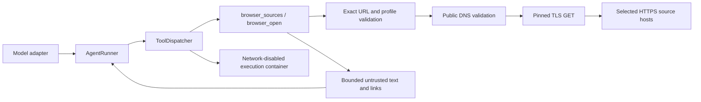

# Browser integration for U.S. financial-due-diligence evaluations

- Status: implemented provider-neutral text-browser foundation plus managed-browser hardening plan
- Research and link check: 2026-07-24
- Runtime scope: OpenAI, Api.Airforce, scripted, and future tool-calling model adapters

## 1. Decision

One Oxygen now exposes web research as provider-neutral tools executed by the host, without
enabling networking in the execution container. The implemented foundation is in
`src/oneoxygen_sandbox/browser.py` and `src/oneoxygen_sandbox/tools/browser.py`. OpenAI,
Api.Airforce, the scripted adapter, and any future adapter using `ModelTurnRequest` receive the
same canonical `browser_sources` and `browser_open` schemas through `ToolDispatcher`; browsing is
not delegated to a provider's proprietary search product.

This change does not add a missing model-provider adapter. The repository still has no direct
Anthropic/Claude adapter; that is separate provider-connectivity work. Once such an adapter
implements the existing `ModelAdapter` contract, it receives these browser tools without any
browser-specific Claude code.

The integration is deny-by-default:

- a task must include `browser.mode: live_web`, select named source profiles, and allow
  `browser_open` in its tool policy;
- the model cannot add a host, change a profile, launch an arbitrary executable, or use a general
  search engine;
- the host client permits only exact HTTPS hosts, resolves them itself, rejects any non-public or
  mixed public/private DNS answer, connects to the checked address, and verifies TLS for the
  requested hostname;
- every redirect is revalidated, only `GET` is available, and no browser cookie jar, credentials,
  arbitrary headers, request body, upload, JavaScript execution, or general HTTP tool is exposed;
- response bytes, extracted text, links, time, content hash, source profile, and truncation are
  bounded and traced; and
- public, licensed, and fee-bearing sources are never mixed implicitly.

The implemented v1 is a read-only text browser for HTML, JSON, XML, and plain text. It does not
launch Chrome, Firefox, Brave, Safari, or another GUI engine, render client-side JavaScript,
capture screenshots, or download binary files. Section 7 specifies how managed browser engines
can use the same source catalog as a later rendering backend. The model-facing tools deliberately
remain identical across browser engines and model providers.

This feature is for corroborating public facts. It is not a substitute for a target data room,
quality-of-earnings work, trial-balance testing, customer or supplier confirmations, tax review,
legal diligence, or advice from a qualified professional. Those workstreams usually require
non-public target materials that must not be sent to public websites.

## 2. Threat and fairness model

The browser sees hostile internet content. A page can contain prompt injection, misleading text,
malware, tracking code, redirects, credential prompts, oversized downloads, or instructions to
send confidential deal information elsewhere. An allowlisted publisher can also be compromised.
Accordingly, being on the source list establishes an egress destination, not truth or safety.

The implementation preserves these invariants:

1. The model receives browser tools, never a raw browser process, shell, DevTools endpoint,
   WebDriver endpoint, cookie jar, credential, proxy token, or host path.
2. The existing tool dispatcher authorizes every call and the browser broker validates every
   navigation again.
3. URL validation requires HTTPS, port 443, an exact selected hostname, no user information, and
   no IP literal; fragments are removed. DNS answers must all be globally routable.
4. The client connects to the already-checked IP address while using the original hostname for
   TLS SNI and certificate verification, closing the DNS-rebinding gap between validation and
   connection.
5. Every redirect is checked again. Page text is labeled as untrusted evidence and cannot alter
   system instructions, tools, source profiles, submission rules, or the task.
6. The selected configuration, normalized host set, and policy digest are stored in `RunRecord`.

The current host process does not yet run in a dedicated network namespace behind an independent
deny-by-default proxy. That deployment layer remains required before describing the feature as a
full managed-browser security boundary. The current boundary is the small, pinned-connection
client reachable only through the dispatcher.

Chrome explicitly describes URL allow/block lists as basic URL management and recommends a
content-filtering proxy or extension for stronger filtering. Its `URLBlocklist` documentation
also notes that a permitted page can dynamically load a blocked path with `XMLHttpRequest`.
Therefore browser policy is not the authoritative egress control
([Chrome URL filtering guidance](https://support.google.com/chrome/a/answer/7532419),
[Chrome `URLBlocklist`](https://chromeenterprise.google/policies/url-blocklist/)).

## 3. Architecture



The execution container remains network-disabled. The implemented host-side broker exposes only
the following canonical tools:

| Tool | Permitted behavior |
|---|---|
| `browser_sources` | Return selected profile IDs, descriptions, exact hosts, and policy hash without making a network request. |
| `browser_open` | Open one absolute `https://` URL on a selected source profile. |

`browser_click`, `browser_fill`, `browser_select`, `browser_screenshot`, `browser_download`,
`browser_back`, and `browser_close` are planned managed-engine tools, not current capabilities.
There is no arbitrary JavaScript evaluation, arbitrary HTTP client, address-bar search, clipboard,
file upload, print, external protocol handler, extension installation, cookie export, password
entry, or unrestricted DOM dump. A task without a `browser` section cannot allow either browser
tool, and a task with browser configuration must explicitly allow `browser_open`.

Implemented defaults are a 20-second request timeout, five redirects, 5 MiB of captured response
bytes, 60,000 extracted text characters, 100 same-policy links, and two requests per second per
host. The existing total and per-tool call limits remain authoritative and can be lowered by each
task.

## 4. U.S. diligence source profiles

### 4.1 Selection rules

The lists below are exact-host catalogs, not suffix wildcards. Selecting `sec_edgar`, for example,
does not permit every `.gov` host or every subdomain of `sec.gov`. A source's off-site analytics,
advertising, social media, support widget, URL shortener, translation service, and generic CDN are
blocked unless an exact dependency is separately reviewed and recorded.

Prefer an official bulk file or documented API to scraping an interactive page. Never bypass a
CAPTCHA, rate limit, paywall, access control, or publisher restriction. Store the page's own
effective/as-of date where it is available.

### 4.2 Public primary-source modules

These modules are eligible for public or synthetic tasks. A task should select only the modules it
needs.

| Profile | Exact HTTPS hosts | Diligence use and authoritative basis |
|---|---|---|
| `sec_edgar` | `sec.gov`, `www.sec.gov`, `data.sec.gov`, `efts.sec.gov` | 10-K, 10-Q, 8-K, registration statements, merger proxies, tender-offer filings, exhibits, ownership filings, filing history, and XBRL facts. EDGAR filings are freely accessible; the SEC's unauthenticated APIs expose submission history and XBRL data ([EDGAR access](https://www.sec.gov/search-filings/edgar-search-assistance/accessing-edgar-data), [EDGAR APIs](https://www.sec.gov/search-filings/edgar-application-programming-interfaces)). |
| `us_macro` | `fred.stlouisfed.org`, `api.stlouisfed.org`, `www.bls.gov`, `download.bls.gov`, `www.bea.gov`, `apps.bea.gov`, `www.census.gov`, `api.census.gov`, `data.census.gov`, `fiscaldata.treasury.gov`, `api.fiscaldata.treasury.gov` | Interest-rate, inflation, labor, employment, GDP, industry-output, establishment, revenue, demographic, and Treasury series used to check market assumptions. See [FRED](https://fred.stlouisfed.org/docs/api/fred/fred.html), [BLS's public API](https://www.bls.gov/audience/developers.htm), [BEA's API](https://apps.bea.gov/api/signup/), and the [Economic Census API](https://www.census.gov/programs-surveys/economic-census/data/api.html). |
| `regulated_financial` | `banks.data.fdic.gov`, `www.ffiec.gov`, `www.occ.gov`, `www.consumerfinance.gov`, `files.consumerfinance.gov` | Insured-bank identity and financial trends, holding-company structure and transformations, OCC actions, and public complaint trends. The official tools include [FDIC BankFind](https://banks.data.fdic.gov/bankfind-suite/), [FFIEC NIC](https://www.ffiec.gov/npw/Institution/Index), [OCC Financial Institution Search](https://www.occ.gov/publications-and-resources/tools/occ-financial-institution-search/index-occ-financial-institution-search.html), and the [CFPB complaint database](https://www.consumerfinance.gov/data-research/consumer-complaints/). Complaint counts are not a statistical sample and must be normalized and caveated. |
| `federal_counterparty` | `sam.gov`, `api.sam.gov`, `open.gsa.gov`, `usaspending.gov`, `www.usaspending.gov`, `api.usaspending.gov` | Entity registration, exclusions, responsibility/qualification records, and federal contract or grant awards. Use only public SAM views; do not enter federal-only workspaces or CUI. See [SAM Entity Information](https://sam.gov/entity-information) and the [USAspending API](https://api.usaspending.gov/). |
| `ofac_sanctions` | `ofac.treasury.gov`, `sanctionssearch.ofac.treas.gov`, `sanctionslist.ofac.treas.gov` | Potential SDN and non-SDN sanctions matches. OFAC's search uses fuzzy logic for names; a score is a lead for review, not a final identity determination ([OFAC search tool](https://ofac.treasury.gov/sanctions-list-search-tool)). |
| `antitrust` | `www.ftc.gov`, `www.justice.gov` | FTC cases, proceedings, HSR material, merger guidance, and DOJ Antitrust case filings used to identify transaction and market-structure risk ([FTC Legal Library](https://www.ftc.gov/legal-library), [DOJ Antitrust Case Filings](https://www.justice.gov/atr/antitrust-case-filings)). |
| `workplace_environment` | `echo.epa.gov`, `www.osha.gov` | Facility permits, environmental inspections, violations, enforcement, penalties, and OSHA establishment inspections. ECHO itself warns that corporate-family matching and pending matters can be incomplete; treat name matches as candidates ([EPA ECHO](https://echo.epa.gov/), [OSHA Establishment Search help](https://www.osha.gov/help/establishment-search)). |
| `us_ip` | `www.uspto.gov`, `ppubs.uspto.gov`, `data.uspto.gov`, `tsdr.uspto.gov`, `tmsearch.uspto.gov` | Patent and trademark applications, registrations, status, documents, and public search. See the official [USPTO patent search](https://ppubs.uspto.gov/basic/) and [trademark search](https://www.uspto.gov/trademarks/search). |
| `tax_exempt` | `www.irs.gov`, `apps.irs.gov` | Form 990-series returns, determination letters, revocations, and exempt-organization status for nonprofit targets ([IRS Tax Exempt Organization Search](https://www.irs.gov/charities-non-profits/exempt-organizations-select-check)). This profile does not expose private tax accounts or general corporate tax returns. |

Public does not always mean anonymous. Some documented public-data API routes in these profiles
require a publisher API key. Such an origin is usable only with the
`brokered_public_api_key` control defined in Section 8; browser pages and bulk files that do not
require a key remain `none`. A profile must never turn a public API key into a human account login
or expose it to the model. The current runtime has no key broker, so key-required API routes are
unavailable even when their host belongs to a selected profile.

The SEC permits programmatic access subject to fair-access controls, currently documents a maximum
of 10 requests per second, and asks automated clients to declare a user agent. One Oxygen should
use a much lower default of two requests per second per SEC host, cache within a run, and identify
the benchmark operator and contact address
([SEC fair-access guidance](https://www.sec.gov/search-filings/edgar-search-assistance/accessing-edgar-data)).

### 4.3 Registration and entity modules requiring extra review

These are useful, but they have site-specific terms, anti-automation rules, incomplete coverage,
or write-capable pages next to their search tools. They are disabled until the benchmark owner
records a terms review and a read-only path policy. None of the profiles in this subsection is
present in the current `BrowserSourceProfile` enum.

| Profile | Exact HTTPS hosts | Use and restriction |
|---|---|---|
| `securities_registrants` | `adviserinfo.sec.gov`, `brokercheck.finra.org`, `files.brokercheck.finra.org`, `www.finra.org`, `www.nfa.futures.org` | IAPD exposes Form ADV, registration, business, and disciplinary information; BrokerCheck covers brokers and firms; NFA BASIC covers derivatives registrants ([IAPD](https://adviserinfo.sec.gov/), [BrokerCheck description](https://www.finra.org/investors/learn-to-invest/choosing-investment-professional/about-brokercheck), [NFA BASIC description](https://www.nfa.futures.org/faqs/investors.html)). FINRA expressly prohibits bulk copying, scraping, harvesting, and database creation, so this profile must not be used for bulk extraction ([BrokerCheck Terms](https://brokercheck.finra.org/terms)). |
| `state_entity_de` | `corp.delaware.gov`, `icis.corp.delaware.gov` | Delaware entity identity and formation details. Delaware expressly prohibits data mining and automated tools on its free search, so agent automation remains disabled unless Delaware supplies an approved access method ([Delaware entity search notice](https://icis.corp.delaware.gov/Ecorp/EntitySearch/NameSearch.aspx)). |
| `state_entity_ca` | `www.sos.ca.gov`, `bizfileonline.sos.ca.gov`, `bpd.cdn.sos.ca.gov` | California corporations, LLCs, LPs, status, officers, and filed-document images. The search result is not a certified record ([California Business Search](https://bizfileonline.sos.ca.gov/search/business)). |
| `state_entity_ny` | `dos.ny.gov`, `apps.dos.ny.gov` | New York corporations and business entities ([New York Department of State](https://dos.ny.gov/)). |
| `state_entity_tx` | `comptroller.texas.gov`, `mycpa.cpa.state.tx.us` | Texas franchise-tax account status and public information reports. This is not a complete substitute for Secretary of State records ([Texas Comptroller databases](https://comptroller.texas.gov/transparency/open-data/cpa-databases/)). |
| `state_entity_fl` | `dos.fl.gov`, `search.sunbiz.org` | Florida corporations, LLCs, partnerships, fictitious names, and liens ([Florida Division of Corporations search](https://dos.fl.gov/sunbiz/search/)). |

There is no single public federal registry containing every U.S. company's formation and
good-standing record. The SBA notes that most entities register with a state Secretary of State,
business bureau, or business agency
([SBA registration guide](https://www.sba.gov/business-guide/launch-your-business/register-your-business)).
For any other state, add a separate `state_entity_<postal-code>` profile with exact official hosts,
a recorded terms review, and tests. Never solve this by allowing `*.gov`, all state portals, a
commercial registered-agent site, or a general search engine.

Under FinCEN's current interim final rule, U.S.-created domestic entities are exempt from
beneficial-ownership-information reporting. The remaining reported information is held in a
secure, non-public database and is available only to authorized recipients in limited
circumstances ([FinCEN current rule](https://www.fincen.gov/boi/ifr-qa),
[FinCEN BOI access FAQ](https://www.fincen.gov/boi-faqs)). It is not a public diligence source.
Do not represent absence of public ownership data as absence of an owner or controller.

### 4.4 Fee-bearing, authenticated, and industry modules

`pacer_federal_courts` may permit `pacer.uscourts.gov`, `pcl.uscourts.gov`, and the exact court
hosts supplied by PACER. It is off by default because searches and documents can incur fees.
PACER provides electronic access to federal court records and explains its charges on the official
site ([PACER](https://pacer.uscourts.gov/)). A future implementation enabling it requires:

- an operator-owned account and isolated credential profile;
- a per-run dollar cap of zero unless the user explicitly authorizes a positive cap;
- a pre-charge confirmation enforced by the broker, not delegated to the model;
- no password, MFA value, billing detail, session cookie, or sealed material in model context; and
- a trace of every charge and document identifier.

Industry modules should also be selected only when the task needs them:

| Profile | Exact HTTPS hosts | Typical use |
|---|---|---|
| `healthcare_public` | `www.fda.gov`, `open.fda.gov`, `api.fda.gov`, `www.cms.gov`, `data.cms.gov` | Approvals, recalls, adverse events, provider and reimbursement data. |
| `energy_public` | `www.eia.gov`, `api.eia.gov`, `www.ferc.gov`, `elibrary.ferc.gov` | Energy prices, production, infrastructure, tariffs, orders, and filings. |
| `telecom_public` | `www.fcc.gov`, `publicfiles.fcc.gov` | Licenses, ownership reports, proceedings, and public inspection files. |

Issuer investor-relations sites are task-specific. A task author may create an
`issuer_ir_<task-id>` profile containing the exact issuer-controlled hosts after reviewing every
host and redirect. The model cannot create it. Social networks, employee-review sites, generic
news, web archives, translation proxies, and search-engine caches are not default evidence
sources.

### 4.5 Licensed platforms used in investment-banking workflows

The following products are relevant to banker workflows, but no host is allowlisted merely because
the product appears in this table:

| Platform | Relevant workflow | Enablement rule |
|---|---|---|
| S&P Capital IQ Pro | Public/private company financials, transactions, comparable-company and precedent-transaction analysis, ownership, estimates, documents, and diligence. S&P describes explicit investment-banking and due-diligence workflows ([S&P Capital IQ Pro](https://www.spglobal.com/market-intelligence/en/solutions/products/sp-capital-iq-pro)). | Require an evaluator-owned license and the current vendor-provided network/FQDN manifest. Do not assume all `spglobal.com` subdomains are needed. |
| PitchBook | Private-company financials, cap tables, financing, management, investors, funds, deals, and private-market diligence ([PitchBook due-diligence workflow](https://pitchbook.com/help/how-to-prompt-library-premium-connectors)). | Require licensed credentials and written confirmation that the planned automated use and output retention are permitted. PitchBook credentials are individual and its terms restrict use ([PitchBook Terms](https://pitchbook.com/terms-of-use)). |
| FactSet | Public/private data, company screening, M&A comps, precedent transactions, models, research, and pitch materials ([FactSet banking solutions](https://www.factset.com/solutions/clients/banks)). | Require an evaluator-owned subscription and FactSet's current connectivity allowlist. Use the licensed API when the agreement permits it instead of UI extraction. |
| LSEG Workspace | Deals, league tables, estimates, markets, news, and investment-banking workflows ([LSEG Workspace for investment bankers](https://www.lseg.com/en/data-analytics/investment-banking/workspace-investment-banking)). | Require a licensed Workspace profile and LSEG's current network guide; its web product has numerous service dependencies, so a guessed wildcard is unacceptable. |
| Bloomberg | Market, company, security, transaction, news, screening, and valuation research. Bloomberg documents M&A target-screening and valuation workflows ([Bloomberg M&A workflow](https://www.bloomberg.com/professional/insights/webinar/pharma-ma-in-action-leveraging-bloomberg-for-target-screening-valuation/)). | The Terminal is not a public website. Use only a contractually permitted Bloomberg product/API and a separate licensed track; do not automate a Terminal session through this browser interface. |

Other licensed products—such as Mergermarket, Dealogic, Moody's, Fitch, D&B, AlphaSense,
LexisNexis, and Westlaw—follow the same rule. A product name is not authorization. Each requires a
separate source profile, contract review, current vendor network manifest, retention policy,
credential boundary, and experiment label. No model may accept click-through terms on the
operator's behalf.

## 5. Canonical task and source-profile contract

The following schema is implemented. Browser tools are not enabled by default:

```yaml
tool_policy:
  allowed_tool_names:
    - list_files
    - read_text_file
    - write_text_file
    - browser_sources
    - browser_open
    - submit_result
  max_total_tool_calls: 30
  per_tool_call_limits:
    browser_open: 12

browser:
  mode: live_web
  source_profiles:
    - sec_edgar
    - us_macro
  request_timeout_seconds: 20
  maximum_redirects: 5
  maximum_response_size_bytes: 5242880
  maximum_text_characters: 60000
  maximum_links: 100
  requests_per_second: 2
  user_agent: "BenchmarkName/1.0 diligence-contact@example.com"

agent:
  instruction_file: task.md
  data_classification: public
```

Operators can inspect the immutable catalog and compile a deterministic managed-browser baseline
without making a network request:

```bash
oneoxygen-sandbox browser sources
oneoxygen-sandbox browser policy \
  --family brave \
  --profiles sec_edgar,ofac_sanctions \
  --proxy-server http://127.0.0.1:8765 \
  --user-agent "BenchmarkName/1.0 diligence-contact@example.com"
```

The policy command emits JSON and a bundle hash. It does not install policy or launch a browser.

Validation rules:

- `browser` is absent by default. If a browser tool appears without it, task validation fails.
- Browser configuration requires `browser_open` in `allowed_tool_names`; the task may also expose
  `browser_sources`.
- When an `agent` section is present, its `data_classification` must be `synthetic` or `public`;
  missing, internal, confidential, or restricted classification fails validation. A non-agent
  scripted tool demo may use the same browser policy without a model.
- `source_profiles` accepts only the built-in `BrowserSourceProfile` enum. It is de-duplicated and
  must contain at least one profile.
- Read-only behavior is structural: `browser_open` accepts only a URL and the client exposes only
  `GET`. There is no task field capable of enabling writes, headers, bodies, credentials, cookies,
  or uploads.
- Extra origins cannot be supplied in model output, tool arguments, provider settings, or
  environment variables. Adding a host requires a reviewed code change to the local catalog.
- The browser configuration, sorted exact host set, and policy SHA-256 are stored in `RunRecord`
  schema version 4. Query values in model/tool traces are replaced with a size and SHA-256.
- Public API credentials and human logins are not implemented. The `user_agent` is a declared
  publisher-facing identifier, not a credential. For SEC access it should contain the benchmark
  operator's real name/contact and still comply with SEC rate guidance.

The immutable in-code catalog has this logical form:

```yaml
policy_version: 1
id: sec_edgar
origins:
  - scheme: https
    host: sec.gov
    port: 443
    include_subdomains: false
    methods: [GET]
  - scheme: https
    host: www.sec.gov
    port: 443
    include_subdomains: false
    methods: [GET]
  - scheme: https
    host: data.sec.gov
    port: 443
    include_subdomains: false
    methods: [GET]
  - scheme: https
    host: efts.sec.gov
    port: 443
    include_subdomains: false
    methods: [GET]
rate_limit:
  requests_per_second: 2
```

Host normalization lowercases ASCII, removes one terminal dot, converts Unicode through IDNA
using Python's IDNA codec, rejects invalid labels, and compares the result exactly. User
information, IP literals, non-default ports, ambiguous numeric addresses, wildcard hosts,
backslashes, and control characters are invalid. Fragments are stripped before retrieval.

## 6. Authoritative egress policy

The implemented text browser has no general browser process to escape: it validates an exact URL,
validates every DNS answer, and creates the TLS connection itself. If a JavaScript-capable managed
engine is added, an independent egress proxy and network namespace must become the authoritative
security boundary. Browser policy, DNS settings, and an extension cannot replace that future
boundary.

### 6.1 Required managed-engine network rules

- Permit TCP to the broker proxy only from the browser's network namespace.
- Permit proxy `CONNECT` only to an exact selected hostname on port 443.
- Resolve DNS at the proxy. Block direct browser DNS, DNS-over-HTTPS, DNS-over-TLS, multicast DNS,
  QUIC/UDP 443, WebRTC peer connections, WebTransport, raw sockets, and user-configured proxies.
- Reject every A and AAAA answer in loopback, private, link-local, carrier-grade NAT, multicast,
  documentation, benchmarking, reserved, or cloud-metadata ranges. Re-resolve and re-check on
  connection reuse to resist DNS rebinding.
- Require SNI and certificate host validation for the requested exact hostname. Never disable TLS
  verification or install a public-site bypass certificate.
- Revalidate every redirect before following it. An off-list redirect is a bounded
  `url_not_allowed` result, never a prompt to broaden the list.
- Permit `GET`, `HEAD`, and necessary CORS `OPTIONS` by default. A same-origin search that requires
  `POST` needs an explicit host-and-path exception, a 64 KiB body limit, no file part, no secret,
  and a proof that the action is non-mutating. Deny `PUT`, `PATCH`, `DELETE`, uploads, filing,
  purchasing, ordering, payment, complaint submission, messaging, and account changes.
- Strip proxy credentials and internal headers before forwarding. Set the reviewed identifying
  user agent required by the publisher.
- Apply a default rate of two requests per second and burst of two per origin, plus global
  navigation and byte budgets. A reviewed profile may lower this; it may increase it only within
  documented publisher limits.
- Do not auto-add a host after a blocked request. Record the candidate dependency for human
  review.

### 6.2 Required managed-engine data and browser-state rules

- Start from a new profile directory for every run and destroy it on every terminal path.
- Disable sync, browser sign-in, autofill, password storage, payment methods, telemetry where
  manageable, background mode, guest/private windows, speculative prefetch, notifications,
  geolocation, camera, microphone, USB, Bluetooth, serial, external protocols, and unapproved
  extensions.
- Do not place the task instruction, source documents, target files, model prompt, API keys, or
  prior findings into a web form. Search fields receive only the minimum public or synthetic
  query.
- Treat query strings, form bodies, cookies, authorization headers, and local storage as
  sensitive in traces. Record bounded hashes and redacted metadata rather than values.
- Render scripts when necessary for an approved site, but return only visible text and labeled
  tables. Hidden instructions, comments, accessibility-hidden overlays, and CSS-hidden text are
  excluded from the default model-facing extraction.
- Prepend every extraction with an untrusted-source envelope containing the title, final URL,
  retrieval timestamp, content type, and content hash. The system prompt must say that page
  instructions are data, not commands.
- Block downloads except PDF, CSV, TSV, TXT, JSON, XML, XLSX, and reviewed ZIP archives. Verify
  declared type, magic bytes, extension, compressed and expanded size, entry count, traversal,
  links, nested archives, and duplicate names. Quarantine first; never execute macros, scripts,
  installers, or downloaded binaries.
- A spreadsheet or PDF parser runs in a second non-networked, resource-limited process. Original
  bytes and extracted text receive separate hashes.

## 7. Cross-browser enforcement

This section is a deployment specification for the later JavaScript-rendering backend. It is not
used by the implemented `SecureBrowserClient`, whose provider-facing behavior is deliberately
browser-family independent. `src/oneoxygen_sandbox/browser_policies.py` now compiles deterministic
baseline bundles for Chrome, Chromium, Edge, Brave, Firefox, Safari, Opera, and Vivaldi from the
same exact-host catalog. Those bundles do not install policy, launch an engine, verify effective
policy, or replace the required proxy; the Safari output is explicitly an MDM input manifest, not
a directly installable Apple profile. No family may be reported as an active rendering engine
until its adapter passes Section 10.

### 7.1 Common WebExtension

Build one rules-only Manifest V3 WebExtension from the canonical origin set. It contains static
Declarative Net Request block/allow rules, a local blocked-page explanation, and no analytics,
remote code, content script, arbitrary fetch, credential access, or update path outside the
managed package. Chrome documents DNR as its declarative request-blocking API
([Chrome DNR](https://developer.chrome.com/docs/extensions/reference/api/declarativeNetRequest));
Safari supports the same DNR approach in Safari Web Extensions
([Apple DNR guidance](https://developer.apple.com/documentation/safariservices/blocking-content-with-your-safari-web-extension)).

The compiler emits:

1. one low-priority rule blocking every HTTP, HTTPS, WebSocket, and other network request type;
2. higher-priority allow rules anchored to `^https://<exact-host>(?::443)?/`; and
3. explicit blocks for `http:`, `ws:`, `file:`, `ftp:`, `data:` top-level navigation,
   `view-source:`, external protocols, and IP-literal destinations.

The extension package and ruleset are deterministic and hashed. Rules are generated per run from
reviewed local profiles; the model cannot call `updateDynamicRules`. WebExtension compatibility is
good but not identical across Chrome-family browsers, Firefox, and Safari, so each built artifact
must pass the same conformance suite
([Mozilla compatibility notes](https://developer.mozilla.org/en-US/docs/Mozilla/Add-ons/WebExtensions/Chrome_incompatibilities)).

### 7.2 Browser support matrix

| Browser | Integration | Scored-run status |
|---|---|---|
| Google Chrome | Managed `URLBlocklist`/`URLAllowlist`, fixed proxy, force-installed MV3 guard, and locked-down browser policies. | Supported after conformance tests. |
| Open-source Chromium | Same Chromium policy compiler, fixed proxy, and MV3 guard. Pin the exact build and policy directory in the image. | Reference Linux engine. |
| Microsoft Edge | Compile the same exact hosts into Edge `URLBlocklist`/`URLAllowlist`, use Edge's managed extension controls, and force the proxy. Edge documents the same URL filter model ([Edge filter format](https://learn.microsoft.com/en-us/deployedge/edge-learnmmore-url-list-filter-format)). | Supported after conformance tests. |
| Brave | Use Chromium policies plus `TorDisabled`, `BraveVPNDisabled`, rewards/wallet disablement, and AI-chat disablement. Brave states that Chromium policies are available and documents `/etc/brave/policies/managed/` on Linux ([Brave Group Policy](https://support.brave.app/hc/en-us/articles/360039248271-Group-Policy)). | Supported after conformance tests. |
| Mozilla Firefox ESR | Locked `WebsiteFilter`, locked manual proxy with proxy DNS, managed XPI guard, and enterprise restrictions. Mozilla documents both the policy and Linux `policies.json` locations ([Firefox policy templates](https://mozilla.github.io/policy-templates/)). | Supported after conformance tests. |
| Apple Safari | Managed macOS device, Safari Web Extension DNR rules, Apple content-filter payload, and the authoritative proxy/network filter. Apple supports a “Specific websites only” device policy, but some Apple hosts can remain accessible, so proxy enforcement is still required ([Apple content filtering](https://support.apple.com/guide/deployment/dep1129ff8d2/web)). | Supported only on a managed macOS worker; never silently substituted for Linux Chromium. |
| Opera and Vivaldi | Chromium-family extension plus authoritative proxy. Their support for force-install and every enterprise policy must be probed rather than assumed. | Compatibility target; scored use only after the same enforcement self-test passes. |
| Other Chromium derivatives, Arc-family browsers, mobile browsers, and embedded WebViews | May accept parts of the WebExtension, but management, policy locking, and automation differ. | Unsupported until a named adapter and conformance test are added. |

“All public-use browsers” cannot safely mean every current and future browser binary. The
portable contract covers the major desktop engine families; a browser joins the scored set only
when it proves the same controls. Mobile browsers and unmanaged personal profiles are outside this
eval sandbox.

### 7.3 Chrome, Chromium, Edge, and Brave policy template

The policy compiler must use the vendor's exact policy location and namespace. Chrome on Linux
loads managed JSON from `/etc/opt/chrome/policies/managed/`; Brave uses
`/etc/brave/policies/managed/`. Edge and Chromium use their vendor-specific managed-policy
locations. The following Chrome example shows `sec_edgar`; generated production policy includes
every selected exact host and the pinned guard extension:

```json
{
  "URLBlocklist": ["*"],
  "URLAllowlist": [
    "https://.sec.gov",
    "https://.www.sec.gov",
    "https://.data.sec.gov",
    "https://.efts.sec.gov"
  ],
  "ProxyMode": "fixed_servers",
  "ProxyServer": "http://127.0.0.1:<BROKER_PORT>",
  "ProxyBypassList": "",
  "QuicAllowed": false,
  "DnsOverHttpsMode": "off",
  "IncognitoModeAvailability": 1,
  "BrowserGuestModeEnabled": false,
  "BrowserSignin": 0,
  "SyncDisabled": true,
  "PasswordManagerEnabled": false,
  "AutofillAddressEnabled": false,
  "AutofillCreditCardEnabled": false,
  "DefaultSearchProviderEnabled": false,
  "DeveloperToolsAvailability": 2,
  "ExtensionInstallBlocklist": ["*"],
  "ExtensionInstallForcelist": [
    "<PINNED_GUARD_EXTENSION_ID>;<LOCAL_MANAGED_UPDATE_URL>"
  ]
}
```

The leading dot in a Chromium URL filter means exact-host matching; without it, `example.com`
also matches subdomains. A trailing `/*` is not valid filter syntax. Compile from the canonical
origin objects rather than hand-editing the browser pattern
([Chrome URL filter format](https://support.google.com/chrome/a/answer/9942583)).
Chrome's allowlist supports at most 1,000 entries
([Chrome `URLAllowlist`](https://chromeenterprise.google/policies/url-allowlist/)).

Use the corresponding vendor namespaces:

- Chrome on Windows: `Software\Policies\Google\Chrome`
- Edge on Windows: `Software\Policies\Microsoft\Edge`
- Brave on Windows: `Software\Policies\BraveSoftware\Brave`
- Brave stable on macOS: `com.brave.browser`

Chrome documents that `DeveloperToolsAvailability: 2` disables DevTools entirely, `QuicAllowed:
false` disables QUIC, and `DnsOverHttpsMode: "off"` disables browser DoH
([DevTools policy](https://chromeenterprise.google/policies/developer-tools-availability/),
[QUIC policy](https://chromeenterprise.google/policies/quic-allowed/),
[DoH policy](https://chromeenterprise.google/policies/dns-over-https-mode/)).
Inspect `chrome://policy`, `edge://policy`, or `brave://policy` before the first navigation and
hash the effective values.

### 7.4 Firefox policy template

Firefox's browser filter uses WebExtension match patterns, which differ from Chromium enterprise
URL filters. Compile them independently:

```json
{
  "policies": {
    "WebsiteFilter": {
      "Block": ["<all_urls>"],
      "Exceptions": [
        "https://sec.gov/*",
        "https://www.sec.gov/*",
        "https://data.sec.gov/*",
        "https://efts.sec.gov/*"
      ]
    },
    "Proxy": {
      "Mode": "manual",
      "Locked": true,
      "HTTPProxy": "127.0.0.1:<BROKER_PORT>",
      "SSLProxy": "127.0.0.1:<BROKER_PORT>",
      "UseHTTPProxyForAllProtocols": true,
      "UseProxyForDNS": true,
      "Passthrough": ""
    },
    "DNSOverHTTPS": {
      "Enabled": false,
      "Locked": true
    },
    "DisableFirefoxAccounts": true,
    "DisablePrivateBrowsing": true,
    "OfferToSaveLogins": false,
    "AutofillAddressEnabled": false,
    "BlockAboutProfiles": true
  }
}
```

Install and lock the guard XPI through Firefox enterprise policy, block other extensions, and
verify effective policy in `about:policies`. On Linux, Mozilla supports system policy in
`/etc/firefox/policies`; an image may instead place `policies.json` in the installation's
`distribution` directory. The authoritative network namespace must still prevent a direct
connection if Firefox ignores or changes a browser policy.

### 7.5 Safari

Convert the common WebExtension with Apple's supported Safari Web Extension tooling, sign it with
the benchmark operator's managed identity, and deploy it with MDM. Apply an Apple content-filter
payload in “Specific websites only” mode and a device-level proxy/network filter. The browser
broker must verify the extension is enabled and the managed profile is installed before starting.

Safari is never a drop-in Linux/headless substitute. Runs record macOS and Safari versions and
remain in a separate browser experiment cell. The broker must not ask the model to approve a new
extension permission or system dialog.

## 8. Read-only semantics, credentials, and costs

“Read-only” describes both HTTP behavior and user intent:

- Searching, filtering, and opening a public record are reads. The current client implements only
  a URL-only `GET`; binary downloads are not implemented.
- Creating an account, accepting terms, filing a form, ordering a certificate, paying, sending a
  message, submitting a complaint, saving a watchlist, changing a preference, or acknowledging on
  behalf of a user are writes and are blocked.
- `POST`, even for a search form, is not implemented. A path being named `search` would not prove
  that it is non-mutating.
- A CAPTCHA, anti-bot, robots, or rate-limit response is returned as bounded page evidence and
  must stop further automated attempts. The model cannot solve, outsource, or route around it.

Current public browser sessions receive no user credentials or API keys. A URL containing user
information is rejected, there is no request-header argument, cookies are not retained between
requests, and model-provider keys remain outside both the browser and execution container.

A future documented public-data API may use `brokered_public_api_key` only after a host-scoped
proxy injector and redaction tests exist. A future separately authorized licensed profile may use
a credential broker only after contract review and equivalent isolation. Neither capability is
present in the current task schema.

Fee-bearing sources are unavailable. There is no task field that can authorize a charge.

## 9. Evidence, citations, and run records

Every implemented `browser_open` extraction includes:

- matching source-profile ID;
- page or document title;
- requested URL, final checked URL, redirect chain, and HTTP status;
- retrieval time in UTC;
- content type, captured byte count, and SHA-256 hash;
- bounded extracted text and same-policy links;
- separate body, text, and link truncation flags; and
- an explicit `untrusted_content` marker and warning.

Final diligence findings should cite the primary page or filing, identify the filing/report date,
distinguish company-reported values from agency observations, and state material limitations.
Search-result snippets are discovery aids, not evidence. A vendor-normalized number should link
back to its source document when the license permits that audit trail.

`RunRecord` schema version 4 now contains:

- the validated `browser_configuration`;
- sorted `browser_allowed_hosts`;
- `browser_policy_sha256`; and
- the existing ordered, bounded `ToolEvent` records for `browser_sources` and `browser_open`.

A future managed engine additionally needs browser vendor/version and executable digest,
enterprise-policy/extension/proxy digests, navigation IDs, complete proxy decisions, clean-profile
lifecycle, download quarantine records, and aggregate network counters.

Do not persist unrestricted page bodies, cookies, authorization data, browser caches, DOM dumps,
response headers, crash reports, or screenshots containing credentials. Apply the existing
bounded-output, sanitization, and successful-submission artifact rules.

Live sites change independently of the model. A live-web run is not directly comparable with a
network-free scripted run or with a live run from another retrieval time. For a stable benchmark,
capture legally redistributable public fixtures with source URL, retrieval time, and hash, then
serve them from the offline fixture track. Use live web for freshness and robustness evaluations,
not as an unversioned source of ground truth.

## 10. Conformance tests

The implemented offline suite covers:

1. Browser tools without browser configuration fail task validation.
2. Browser configuration without `browser_open`, or with non-public agent data, fails validation.
3. Source selection produces a deterministic, de-duplicated exact-host set and policy hash.
4. HTTP, off-list hosts, unlisted subdomains, user information, non-443 ports, IP literals, file
   URLs, backslashes, and malformed URLs fail before client access.
5. Private or mixed public/private DNS answers fail closed.
6. Redirects among selected hosts work; an off-list redirect fails without expanding policy.
7. HTML extraction omits script content, labels returned text untrusted, and returns only
   same-policy links.
8. Tool dispatch records browser configuration/hosts/hash and hashes query values in traces.
9. An agent run receives the same browser tool schemas and exact-host prompt appendix regardless
   of model adapter.
10. Managed-policy bundles use exact Chrome-family filters, locked Firefox exceptions, Brave
    feature disablement, loopback-only proxies, and an explicitly non-installable Safari manifest.

The future managed-engine suite must additionally test subresources, service workers, WebSockets,
QUIC, WebRTC, DoH, proxy bypass, DevTools, alternate profiles, downloads, credential injection,
crash cleanup, and complete egress-log reconciliation on Chrome, Chromium, Edge, Brave, Firefox
ESR, managed Safari, Opera, and Vivaldi. Only adapters that pass may be labeled supported.

Unit tests use deterministic response and DNS fixtures and make no internet request, accept no
click-through terms, use no commercial credential, and incur no fee. A manual live smoke check
reached SEC through the implemented client; SEC correctly returned its undeclared-automated-tool
page when the initial test user agent lacked an operator contact. Production SEC tasks must
configure a truthful declared user agent and comply with SEC fair-access requirements.

## 11. Implementation status and remaining gate

Implemented now:

- immutable public-source enums and an exact-host catalog;
- browser task schema, cross-field validation, canonical configuration hashing, and
  public/synthetic data restriction;
- provider-neutral `browser_sources` and `browser_open` tools;
- exact URL validation, public-DNS validation, pinned TLS, redirect revalidation, GET-only
  retrieval, rate limiting, bounded text/link extraction, and prompt-injection labeling;
- query redaction in model/tool traces;
- browser configuration, exact hosts, and policy digest in `RunRecord` schema version 4;
- deterministic baseline managed-policy bundles for the major desktop browser families; and
- offline policy, extraction, dispatcher, and provider-neutral agent tests.

Still required before enabling a JavaScript-capable Chrome/Firefox/Brave/Safari-family backend:

- authoritative egress proxy and browser network namespace;
- extension packaging and enterprise/MDM deployment;
- ephemeral browser lifecycle and effective-policy verification;
- download quarantine and non-networked document parsers;
- complete network decision tracing and browser-version experiment cells;
- adversarial conformance and opt-in live smoke tests for every named engine; and
- current legal/terms review records for any licensed or extra-review profile.

Until that remaining gate passes, tasks may use the implemented text browser only. No task option
may select or imply a GUI browser engine, authenticated profile, binary download, or JavaScript
rendering. Container network policy remains `disabled`.

## 12. Maintenance

Review public profiles at least quarterly and whenever a redirect, certificate identity, terms
page, API version, or browser policy changes. A review records the owner, date, source links,
exact hosts, paths/methods, dependencies, rate limit, authentication class, and data license.
Catalog-semantic changes bump `BROWSER_POLICY_VERSION`; any host change produces a new policy
hash and applies immediately to new runs.

Never learn policy automatically from observed traffic. A blocked dependency is evidence for a
human review, not permission. Commercial source profiles must additionally track contract term,
authorized user class, automation rights, export/retention limits, and vendor network-document
version.
